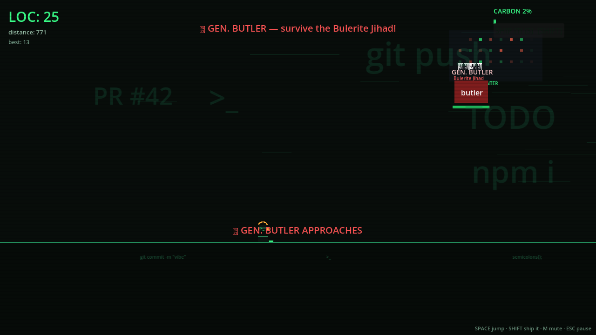
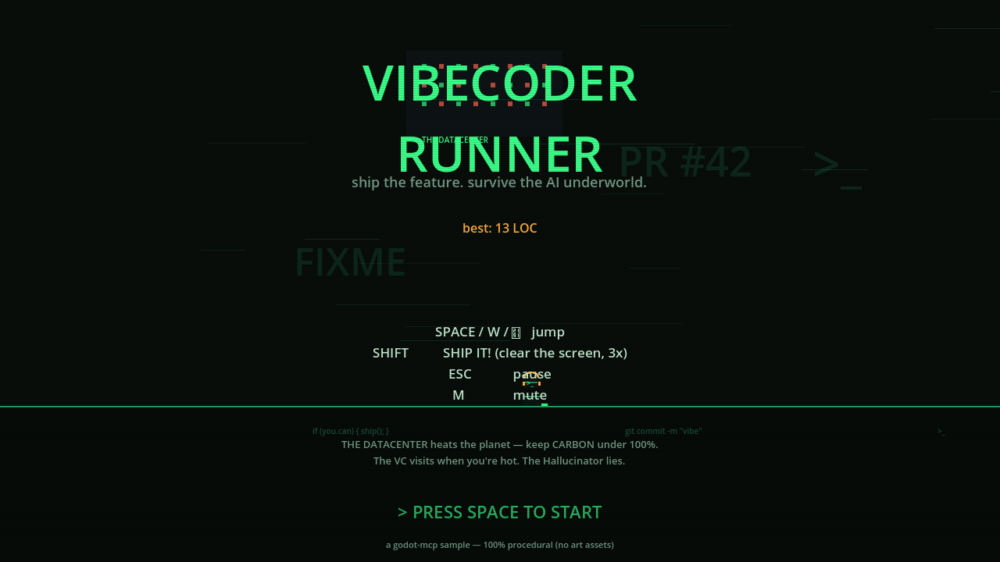

# Vibecoder Runner

You are a vibecoder at 3 AM: headphones on, energy drink in hand, 12 terminals
open. Your feature has to ship — but the AI underworld has other plans.
Run, jump, and **SHIP IT!** through the terminal.



**Theme:** dark terminal green-on-black, procedural visuals only, zero art
assets. Every enemy, obstacle, particle and sound is generated from primitives.



## Play it

```powershell
# via godot-mcp
just demo-run vibecode

# or directly
godot --path samples/vibecode-runner
```

Web build: `just little-game-export web vibecode` →
`build/little-game/vibecode/web/`.

## Controls

| Key | Action |
|-----|--------|
| SPACE / W / ↑ | Jump (coyote time + jump buffering for game-feel) |
| SHIFT | **SHIP IT!** — clear every hazard, -15% carbon (3 charges) |
| ESC | Pause |
| M | Mute |

## The AI Underworld

| Enemy | Behavior |
|-------|----------|
| **IDE obstacles** | VS Code / Windsurf / Cursor blocks litter the floor — jump or die |
| **The Hallucinator** | Teleports ahead, flickers, spawns *fake* energy drinks that hurt |
| **The Prompt Injector** | Hacks your controls: `jump()` → `401` for 2.5s |
| **The Tokenmaxxer** | Big, slow, and hungry — drains your LOC while you're near |
| **Context Window Overflow** | `]` closes the floor lane — jump the rising bracket |
| **Claude Desktop** | Immobile. Touching it triggers an apology stun |
| **Techbro** | Runs ahead dropping jargon mines. "We're hiring!" |
| **Legacy Code** | COBOL strip. Touching it sometimes GOTO-teleports you into danger |
| **The VC** | Visits when you're hot — takes 50% of your LOC in equity |
| **The Meeting** | A swarm of calendar invites homing at you |
| **The Datacenter** | Ambient carbon source — fan blasts and burst pipes, and it heats the planet |
| **GEN. BUTLER** | Every ~700 LOC the Bulerite Jihad arrives: survive his push barrage |

## Systems

- **Score = LOC** — passive rate × multiplier. Distance = commits.
- **Energy drinks** — grab the real ones: 2× LOC for 6s. Trust nothing.
- **Carbon meter** — the Datacenter heats the planet. 100% = the EPA fines
  you into oblivion. SHIP IT! to vent.
- **Best score** — persisted (IndexedDB on web, user:// on desktop).
- **Difficulty ramp** — gaps tighten and the roster unlocks as you ship:
  Hallucinator ≥ 400 LOC, Techbro ≥ 300, Tokenmaxxer ≥ 500, Meeting ≥ 700,
  Injector ≥ 900, Context Overflow ≥ 1200.
- **Boss gauntlets** — survive GEN. BUTLER: phase 2 at 50% doubles the
  barrage. +500 LOC on repush.

## Technical

- Built for Godot 4.4+, GL Compatibility renderer (web-safe).
- 14 GDScript files, all `gdlint`-clean (`.gdlintrc` from godot-mcp).
- 16 procedurally generated WAVs (`tools/gen_audio.py`) — no audio assets.
- Headless smoke test: `godot --headless --path . --script tools/smoke_test.gd`
  (boots, plays 12s with simulated input, exercises boss + all abilities,
  prints SMOKE PASS/FAIL).
- Canvas 1280×720, `stretch/mode=canvas_items`, integer scale.
- `ConfigFile`-based save with no platform-specific code.

## File map

```
project.godot          input map, window, autoloads (Save, Audio)
Main.tscn              full scene tree — no runtime scene loading
scripts/game.gd        state machine, scoring, carbon, contact dispatch
scripts/player.gd      runner physics: coyote, jump buffer, squash & stretch
scripts/spawner.gd     procedural chunks, difficulty curve, VC visits, boss
scripts/enemy_ai.gd    per-kind AI dispatcher (motion + timed abilities)
scripts/hazard_factory.gd  every hazard built from primitives
scripts/boss_butler.gd boss gauntlet (phase 2 at 50%)
scripts/hud.gd         LOC, carbon bar, ship button, banners, pause overlay
scripts/title_screen.gd / game_over.gd   flow screens
scripts/effects.gd     shake, floating text, particle bursts
scripts/audio_manager.gd / save.gd       autoloads
tools/gen_audio.py     regenerates audio/*.wav
tools/smoke_test.gd    headless CI-style smoke test
screenshots/           title + gameplay captures
```

## History

v2.0 (2026-07-31): complete rebuild. The previous committed version was
unplayable (MainScene referenced a missing `Player.gd`) with two divergent
implementations. This version merges the original AI-enemy identity (10 enemy
types) with a proper runner engine, adds procedural audio, game-feel physics,
menus, pause, mute, high scores, boss gauntlets, and web export presets.
